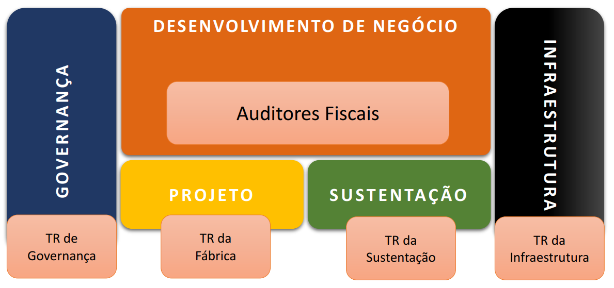

## Desenvolvimento de Negócio

!!! note ""
      Área da SEFAZ, composta pelos Auditores Fiscais / Negócio, responsável por atuar como facilitador do relacionamento entre a COT com Gestores e Consultores de Negócio, no direcionamento, planejamento de chamados e projetos, assistência a equipe técnica com informações de inpacto das mudanças e do funcionamento dos sistemas da sua respectiva área de negóco, bem como fornecer informações estratégicas para suporte à decisões de negócio.
	  
- - -

## Serviços

### Governança e Qualidade

!!! note ""
     Área contratada para prestação de serviços de apoio técnico especializado em Gestão e Qualidade de Software, de forma a obter melhoria contínua nos processos de TIC no âmbito da Secretaria da Fazenda da Prefeitura de Salvador (SEFAZ-PMS), especialmente nas áreas de: métrica de software, auditoria e conformidade, gestão de projetos, arquitetura de software, teste e qualidade de software, gerenciamento de dados e informações e conteúdo web, mediante ordens de serviço dimensionadas em Unidade de Serviço Técnico - UST.

### Fábrica de Software

!!! note ""
     Contratação de serviço especializado em tecnologia da informação, compreendendo o planejamento, execução e implantação, sob demanda, de projetos de desenvolvimento de sistemas informatizados, em regime de fábrica de software, seguindo os padrões e modelos operacionais adotados pela Secretaria da Fazenda da Prefeitura de Salvador (SEFAZ-PMS), mediante ordens de serviço dimensionadas em Pontos de Função - PF.

### Sustentação de Software

!!! note ""
     Contratação de serviço especializado em tecnologia da informação, compreendendo o planejamento, execução e implantação de projetos de manutenção corretiva, evolutiva e adaptativa dos sistemas presentes na Secretaria da Fazenda da Prefeitura de Salvador (SEFAZ-PMS), além da execução de atividades de suporte e apoio, seguindo os padrões e metodologias de desenvolvimento adotados por esta Secretaria,mediante ordens de serviço dimensionadas em Unidade de Serviço Técnico - UST.

### Infraestrutura 

!!! note ""
     O Setor de Infraestrutura é responsável, entre outros, pelos serviços de atendimento e suporte técnico, monitoramento e gestão do parque computacional e da rede de dados, assim como manter, prover e garantir a sua segurança da informação.
---

## Observações 

!!! attention ""
    * Reuniões periódicas de Acompanhamento do Projeto
    * Verificações Periódicas conforme Planejamento / Cronograma 
	
	
## Informações Adicionais  

???+ note "Notas"
    - *Conceitos*	
    - Políticas de Engenharia de Software
    - Políticas de Gestão de Projetos
