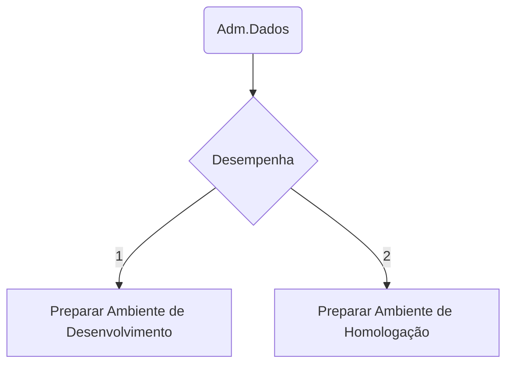

## Definição

!!! note ""
      É o profissional responsável por planejar e organizar o controle dos dados corporativos — gerenciar os dados como recursos de uso comum da sefaz, promovendo-lhes os valores de autenticidade, autoridade, precisão, acessibilidade, seguridade e inteligibilidade. Definir e implementar padrões relativos a administração de banco de dados. Elabora relatórios técnicos, quando solicitado. Define políticas de acesso. Realiza integração,migração de dados e Suporte na construção e otimização de scripts SQL.

- - -

- - -

## Altera

* [Ambiente de Desenvolvimento](enabled by default)
* [Ambiente de Homologação](enabled by default)
* [Base de Dados](enabled by default)

## Tarefas

- [X] Preparar Ambiente de Desenvolvimento 
- [x] Preparar Ambiente de Homologação 

## Observações 

!!! attention ""
    * Reuniões periódicas de Acompanhamento do Projeto
    * Verificações Periódicas conforme Planejamento / Cronograma 
	

	
## Informações Adicionais  

???+ note "Notas"
    - *Conceitos*	
    - Políticas de Engenharia de Software
    - Políticas de Gestão de Projetos
